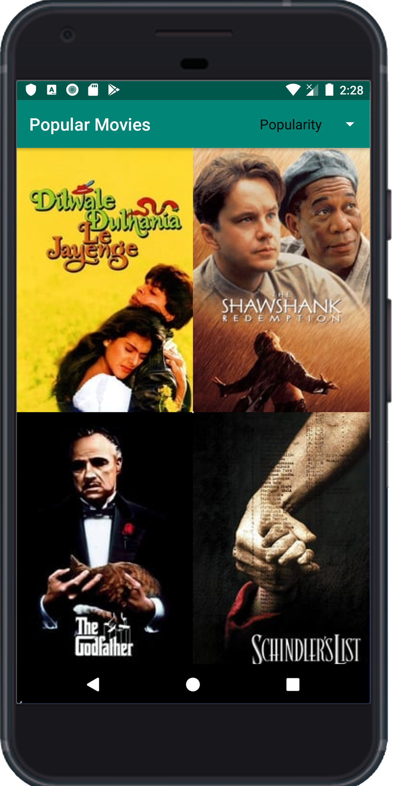
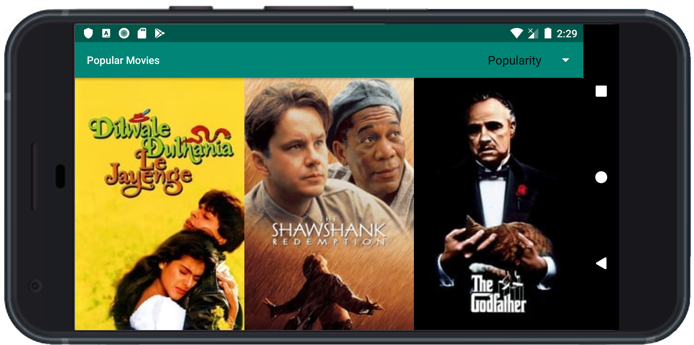
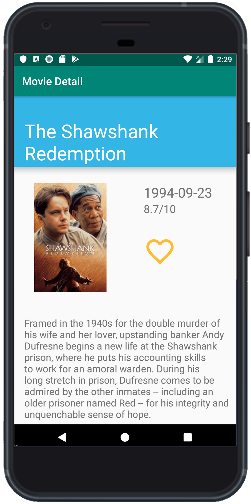
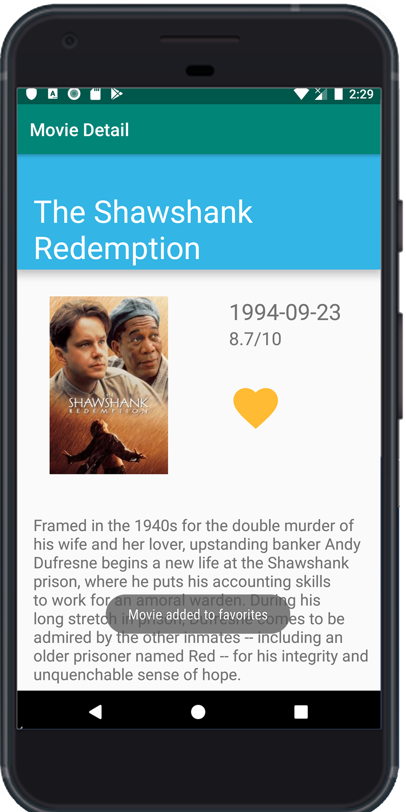
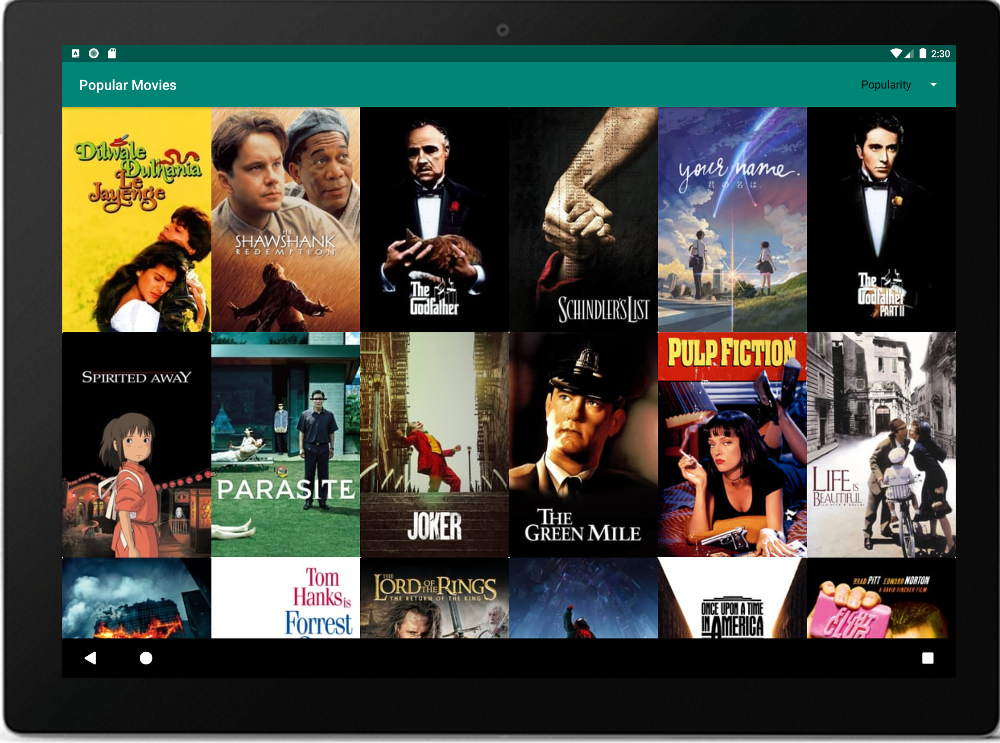
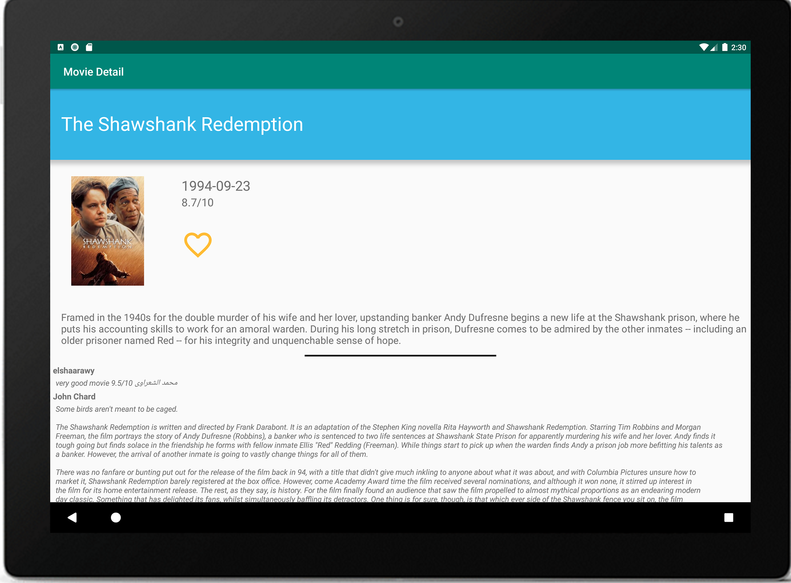

# **PopularMovies**
Popular movies 2 Udacity Nanodegree
In this project implementing The Movie DB API of popular movies, top rated movies, movie's trailers and reviews. 
It also has endless scroll on movies list. It can also save favorited movies and open them in a seperate fragment.
It is also implementing Model View Presenter (MVP) architecture. 

### What I Use
Model View Presenter / MVP Architecture
Shared Preferences
Android Room Persistence
Retrofit
Data Binding
Picasso

### User Interface
  

  

 

### How To Use
Get your [The Movie DB](https://www.themoviedb.org/) API key
Put in API_KEY in Constants.java

### License
<blockquote Copyright 2019 Yahia Salem

Licensed under the Apache License, Version 2.0 (the "License");
you may not use this file except in compliance with the License.
You may obtain a copy of the License at

    http://www.apache.org/licenses/LICENSE-2.0

Unless required by applicable law or agreed to in writing, software
distributed under the License is distributed on an "AS IS" BASIS,
WITHOUT WARRANTIES OR CONDITIONS OF ANY KIND, either express or implied.
See the License for the specific language governing permissions and
limitations under the License.
© 2019 GitHub, Inc.
</blockquote>
